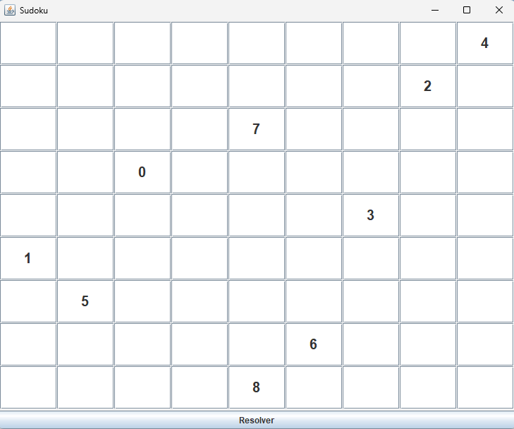
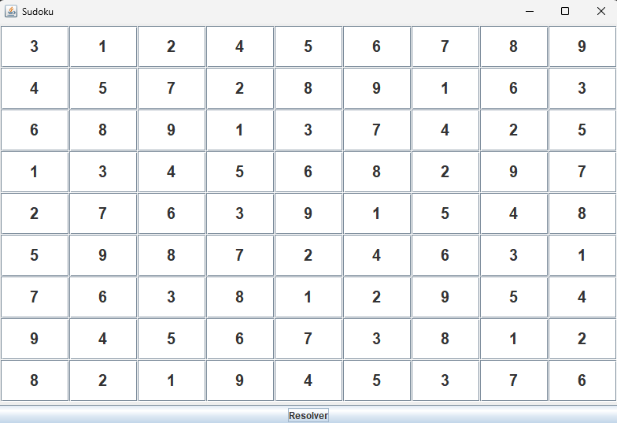

# Sudoku Solver com Interface Gráfica 🧩

## 📚 Este é um projeto de Sudoku desenvolvido em **Java com Swing**, como parte de um exercício acadêmico para a disciplina de Programação Orientada a Objetos.

A aplicação permite ao usuário preencher um tabuleiro com algumas pistas iniciais e clicar em "Resolver" para que o sistema complete automaticamente os espaços vazios utilizando um algoritmo de **backtracking**.

---

## 🎯 Funcionalidades

- Interface gráfica construída com Java Swing
- Entrada manual de números no tabuleiro
- Solução automática ao clicar no botão “Resolver”
- Algoritmo de resolução baseado em busca recursiva (backtracking)

---

## 🛠️ Tecnologias Usadas

- Java 8+
- Swing (GUI)
- NetBeans IDE
- Maven (estrutura do projeto)

---

## 📷 Demonstrações

### Tabuleiro preenchido manualmente:


### Após clicar em "Resolver":


---

## 🚀 Como Executar

1. Clone este repositório:
```bash
git clone https://github.com/seu-usuario/sudoku-swing.git
```

2. Abra no **NetBeans** ou outro IDE Java compatível.

3. Execute o arquivo `Main.java`.

4. Preencha alguns números no tabuleiro e clique em **"Resolver"** para ver o Sudoku ser funcionar.

---

